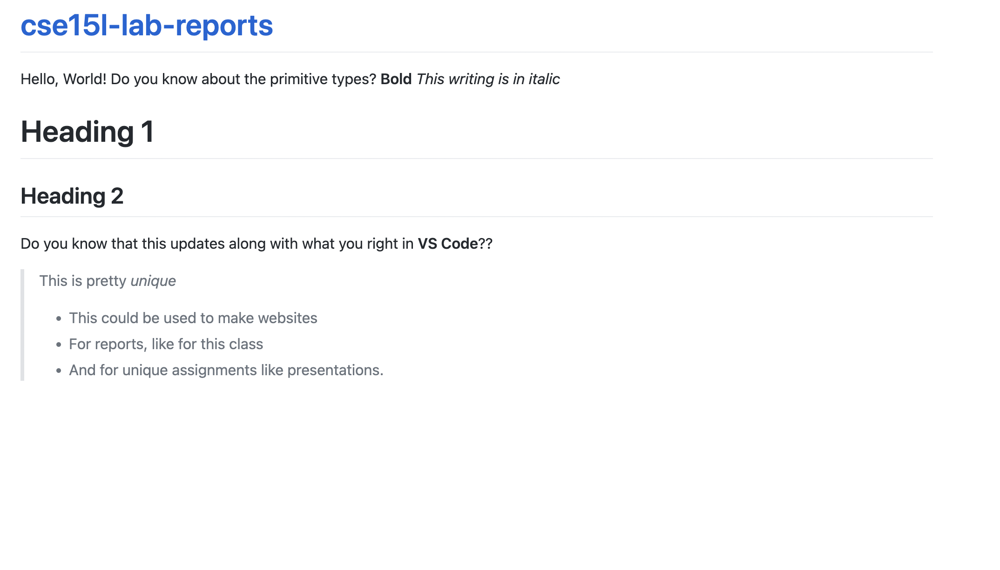

# Lab Report #1 for Week 0

> In this quick little activity I managed to identify how to create easier 

An example of something that I learned in this quick lesson for creating this report was how to create images in the markdown.

## Screenshot Example of practicing in the Markdown
```

```

"In this image, I tried using different formats to write, for example Heading, bold, italic, lists with no order, and lastly blockquote."


--- 


### What are the main objectives that we learned in this lesson?

Based on the [Cheat Sheet](https://commonmark.org/help/) that was given to us, the students it taught us how to do basic formats of writing in the markdown. 

*Some examples were;*
-
   * How to *italic* words 
* How to make **bold** words .
 * How to create  Heading 1
    * How to write Heading 2
    * Heading 3
* Make backquotes with ` > `   
* Making inline codes 
* Making Horizontal rules in Markdown.
* Lastly, making lists that can be in order or not.
    1. This is a 
    2. listed
    3. order

>In this like assignment this is how we created the github,
> the repository and making a page website and how to use 
> VS code to work live with the markdown. 